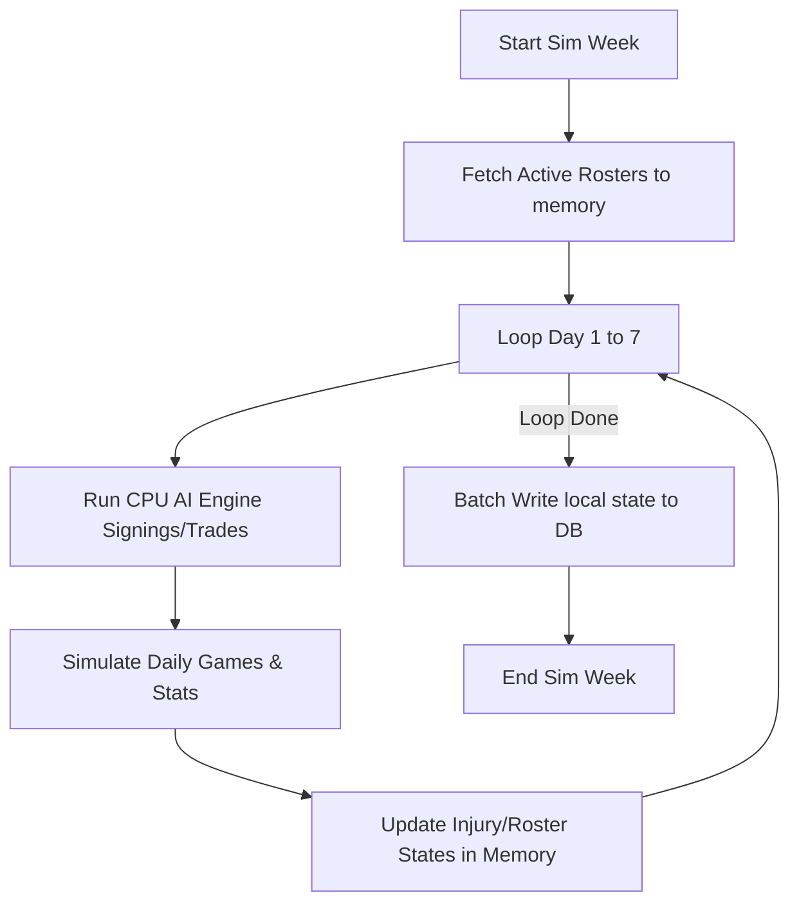

# 🏀 Filipino Basketball Manager

A high-performance, text-based basketball simulation engine and franchise management hub. This project is built as a production-grade showcase of modern web engineering, featuring an in-memory batch simulation pipeline, context-aware CPU AI general managers, real-time asset optimization trading algorithms, and stateful multi-threaded client controls. Its for Filipinos!

---

## 🛠️ Tech Stack & Specifications

- **Framework**: [Next.js 16 (App Router)](https://nextjs.org/)
- **Programming Language**: [TypeScript](https://www.typescript.org/) (Strict compilation, custom domain types)
- **Database ORM**: [Drizzle ORM](https://orm.drizzle.team/) (Sequential sequential queries, zero raw SQL)
- **Database Driver**: [Neon serverless-postgres](https://neon.tech/) (neon-http serverless stateless client)
- **State Management**: [Zustand](https://github.com/pmndrs/zustand) (Franchise identity and timeline sync)
- **Styling**: [Tailwind CSS 4](https://tailwindcss.com/) (Custom HSL color palette, dark-mode glassmorphism)
- **Icons**: [Lucide React](https://lucide.dev/)

---

## 🏗️ Architectural Core & Engineering Solutions

### 1. High-Velocity In-Memory State Pipeline
To solve stateless serverless driver latency and connection overhead, the simulation engine is architected around an in-memory array state pipeline:
- **The Bottleneck**: Simulating 7-day regular season blocks or best-of-7 playoff runs creates heavy read-write connection loops when querying and saving database rows sequentially.
- **The Solution**: Before entering a simulation chunk (in `leagueEngine.ts`), the engine pulls all active `Player` and `Team` rows into local JS memory state arrays. 
- **In-Memory Sim**: The daily CPU front-office AI checks, player injury probability tables, and statistical log generations mutate these local array indices directly.
- **Batch Writer**: At the conclusion of the simulated week, the engine pushes all modified records back to the database in a single round-trip using chunked `db.batch()` queries, bypassing transaction limitations and maximizing IOPS efficiency.



### 2. Rational CPU AI & Asset Optimization Engine
CPU-managed franchises act independently using a dual-layered, context-aware decision matrix (located in `cpuAiEngine.ts` and `tradeEngine.ts`):
- **Positional Balance Layer**: General GMs review their active rosters against positional requirements (`Guard`, `Forward`, `Center`). If a team has a deficit (<3 players in a group) and roster space, they actively scan the free-agent market.
- **Asset Optimization Layer**: If the 8% daily trade trigger hits and no teams have positional surpluses/deficits, the AI triggers an asset optimization audit:
  - **Team A (Cap Clearing)**: GMs seek to trade a player with a higher salary for a lower salary player in the same position group, provided the target player is younger or within 5 OVR points.
  - **Team B (Talent Upgrade)**: Opposing GMs accept the incoming player's higher salary because their OVR is at least +3 higher than the departing asset, provided they stay within the ₱50,000,000 cap space limit.
- **Matching Diversity**: The trade finder shuffles all 29 CPU franchises using a Fisher-Yates algorithm, preventing trade monopolies and ensuring trade offers are distributed organically.

### 3. Rigid Roster Safeguards
Franchises must remain within the strict **12-18 player active boundary limit**. To handle edge cases like severe injury outbreaks or team depleting waivers, the engine implements an automated safety layer:
- **Deficit Checks**: Any team falling below 12 players triggers an automatic free agency signing.
- **NBA-style Minimum Contract Exception**: If the team's active payroll exceeds the ₱50,000,000 salary cap, the engine programmatically signs the player under the Minimum Contract Exception (₱500,000 baseline) to ensure roster integrity without failing cap compliance.
- **Filler Generation**: If the free agent pool is entirely exhausted, the system programmatically generates a local baseline filler player assigned to the minimum salary.

### 4. Interruptible Stateful Simulation Ticker
Simulating long chunks is controlled client-side using an interruptible loop:
- **Thread-Safe Cancellation**: A React `useRef` reference tracks the `isSimulating` status. 
- **Immediate Interruption**: If the user clicks `🛑 Stop Simulating`, the tick loop intercepts the next iteration immediately, halts the scheduler, and leaves the database in a consistent, fully compiled state without crashing or causing half-day writes.

---

## 📂 Project Module Tree

```
filipinobasketballmanager/
├── drizzle/                   # Database migrations output
├── public/                    # Static assets
└── src/
    ├── app/
    │   ├── actions/           # High-performance server actions
    │   │   ├── awardsEngine.ts      # Regular season & Finals MVP awards
    │   │   ├── cpuAiEngine.ts         # CPU daily AI trade & signing behaviors
    │   │   ├── leagueEngine.ts      # Core simulator & game logic calculations
    │   │   ├── offseasonEngine.ts   # Draft pool generation & roster resets
    │   │   ├── offseasonWizard.ts   # Contract renewals & player retirement audits
    │   │   ├── playoffEngine.ts     # Playoff bracket scheduling & fast-forward sims
    │   │   ├── statsEngine.ts       # League stats aggregates & history logs
    │   │   └── tradeEngine.ts       # Trade Block Finder counter-offers & executions
    │   ├── api/               # API endpoints
    │   ├── dashboard/         # Franchise Front Office Views
    │   │   ├── trade-block/page.tsx # Roster trade block & Find Offers modal
    │   │   ├── layout.tsx           # Navigation sidebar & logo branding
    │   │   └── page.tsx             # Active Roster Sheet
    │   ├── layout.tsx         # Root HTML layout with automatic basketball favicon
    │   └── page.tsx           # Franchise Selection Home screen
    ├── db/                    # Drizzle configuration & schema
    │   ├── index.ts           # Neon HTTP client initialization
    │   ├── schema.ts          # Database tables definitions
    │   └── seed.ts            # Culturally authentic league seeder
    └── store/                 # Client state store
        └── useGameStore.ts    # Zustand game variables
```

---

## 🚀 Installation & Local Execution

### 1. Prerequisites
Ensure you have [Node.js](https://nodejs.org/) installed and a Postgres connection URL from [Neon](https://neon.tech/).

### 2. Environment Configuration
Create a `.env.local` file in the root directory and supply your database connection string:
```env
DATABASE_URL=postgres://[user]:[password]@[host]/[database]?sslmode=require
```

### 3. Install Dependencies
```bash
npm install
```

### 4. Seed the Database
Initialize tables and seed the database with 30 culturally authentic teams and 450 initial players:
```bash
npx drizzle-kit push
npm run db:seed  # Or run the seeder script: npx tsx src/db/seed.ts
```

### 5. Start the Development Server
```bash
npm run dev
```
Open [http://localhost:3000](http://localhost:3000) to select your franchise.

### 6. Build for Production
To compile and optimize the production bundle:
```bash
npm run build
npm run start
```
