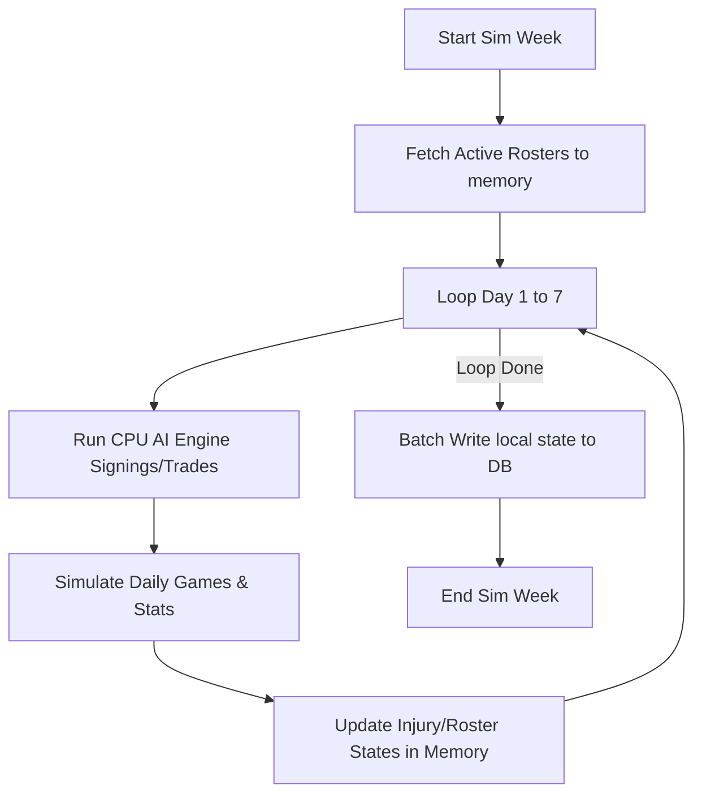
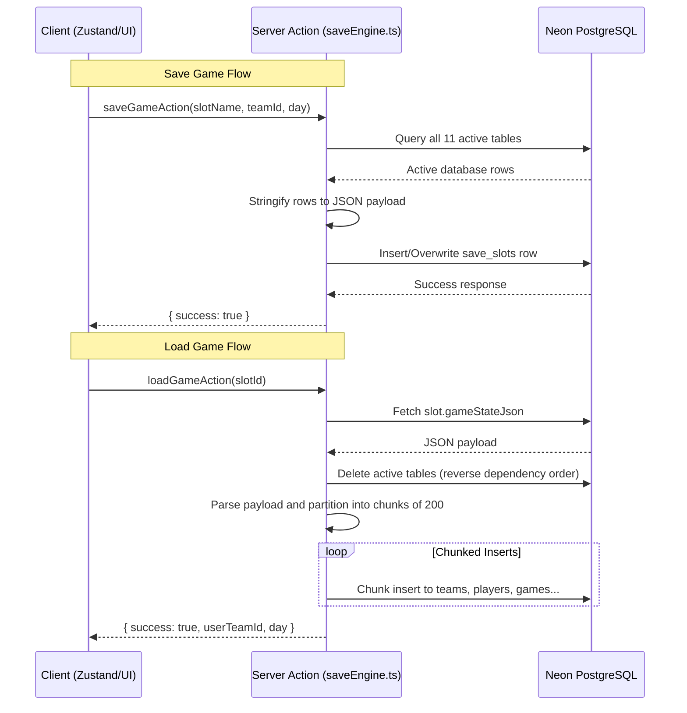

# 🏀 Filipino Basketball Manager (FBM)

A high-performance, text-based basketball simulation engine and franchise management hub. This project is built as a production-grade showcase of modern web engineering, featuring an in-memory batch simulation pipeline, context-aware CPU AI general managers, real-time asset optimization trading algorithms, database-backed save states, and stateful client controls. Built by and for Filipino basketball fans!

---

## 🛠️ Tech Stack & Specifications

- **Framework**: [Next.js 16 (App Router)](https://nextjs.org/)
- **Programming Language**: [TypeScript](https://www.typescript.org/) (Strict compilation, custom domain types)
- **Database ORM**: [Drizzle ORM](https://orm.drizzle.team/) (Sequential queries, zero raw SQL)
- **Database Driver**: [Neon serverless-postgres](https://neon.tech/) (neon-http serverless stateless client)
- **State Management**: [Zustand](https://github.com/pmndrs/zustand) (Franchise identity and timeline sync)
- **Styling**: [Tailwind CSS 4](https://tailwindcss.com/) (Frosted glassmorphism, responsive tables, custom HSL color palette)
- **Icons**: [Lucide React](https://lucide.dev/)

---

## 🏗️ Architectural Core & Engineering Solutions

### 1. High-Velocity In-Memory State Pipeline
To solve serverless driver latency and connection overhead, the simulation engine is architected around an in-memory array state pipeline:
- **The Bottleneck**: Simulating 7-day regular season blocks or best-of-7 playoff runs creates heavy read-write connection loops when querying and saving database rows sequentially.
- **The Solution**: Before entering a simulation chunk (in [leagueEngine.ts](file:///c:/Users/clarkyu/filipinobasketballmanager/src/app/actions/leagueEngine.ts)), the engine pulls all active `Player` and `Team` rows into local JS memory state arrays. 
- **In-Memory Sim**: The daily CPU front-office AI checks, player injury probability tables, and statistical log generations mutate these local array indices directly.
- **Batch Writer**: At the conclusion of the simulated week, the engine pushes all modified records back to the database in a single round-trip using chunked `db.batch()` queries, bypassing transaction limitations and maximizing IOPS efficiency.



---

### 2. Multi-Slot Save/Load & State Serialization
Rather than adding a `saveSlotId` foreign key to every single table in the database and modifying hundreds of SELECT/UPDATE queries across the app, FBM utilizes a single-table JSON state serialization system:
- **Save Operation**: [saveGameAction](file:///c:/Users/clarkyu/filipinobasketballmanager/src/app/actions/saveEngine.ts#L47) queries all records from the 11 active tables (teams, players, games, stats, draft picks, etc.), packages them into a single structured JSON object, and writes it to a designated row in the `save_slots` table.
- **Load Operation**: [loadGameAction](file:///c:/Users/clarkyu/filipinobasketballmanager/src/app/actions/saveEngine.ts#L137) retrieves the slot's `gameStateJson` payload, deletes the active tables sequentially in reverse dependency order, and inserts the saved records.
- **Neon HTTP Chunking**: To prevent payload limitations and HTTP serverless request size errors, the insert queries are automatically batched in chunks of 200 records via `chunkedInsert`.



---

### 3. Post-Seeding Team ID Translation
- **The Problem**: Clicking "Start New Franchise" triggers `resetActiveGameAction`, which runs the database seeder to clean and re-populate the tables. Since Drizzle generates random UUID keys for seeded teams, the user's pre-selected `teamId` is deleted, leading to database mismatch crashes.
- **The Solution**: The seeder now returns the array of newly generated teams with their post-seeding IDs. The frontend selector ([TeamSelectorClient.tsx](file:///c:/Users/clarkyu/filipinobasketballmanager/src/app/TeamSelectorClient.tsx#L138)) automatically matches the selected team by city/mascot name, mapping the selection to the correct new post-seed `teamId` before routing to the dashboard.

---

### 4. Culturally Authentic Names System
FBM implements an authentic name generator powered by static literal pools in [names.ts](file:///c:/Users/clarkyu/filipinobasketballmanager/src/lib/names.ts) containing **6,000+ entries** (exactly 1,000 single-word names per array) to guarantee cultural accuracy:
- **Separated Pools**: Includes distinct pools for Filipino Local First Names, Second Names, Surnames, and Fil-Am First Names, American Second Names, and Fil-Am Surnames.
- **Contamination Controls**: Prevents spaces inside the individual name elements (avoiding duplicate compound names like "Alex Paul Lopez" when second name logic is applied).
- **Hyphenation Rules**: Restricts hyphenation to exactly **1% of the Fil-Am surname pool** (e.g., `"Clarkson-Washington"`) and **0% for local Filipino players** to maintain realistic roster name structures.
- **Probability Matrix**: Local Filipino players have a 40% chance of receiving an optional second name drawn from the local pool, and a 30% chance of receiving a Fil-Am first name.

---

### 5. Premium Custom Overlay Dialogs
All default browser confirm and alert dialogs have been replaced with custom stateful overlays styled with Tailwind glassmorphism:
- **Safeguards**: Intercepts structural actions, such as starting a new franchise (warning about active database resets), deleting save slots, and exiting to the main menu.
- **Branding**: Uses warning-themed accents (Lucide `AlertTriangle` in orange) and danger-themed accents (Lucide `Trash2`/`LogOut` in red) with frosted backdrops and enter/exit micro-animations.

---

### 6. Rational CPU AI & Asset Optimization Engine
CPU-managed franchises act independently using a dual-layered, context-aware decision matrix:
- **Positional Balance Layer**: General GMs review their active rosters against positional requirements (`Guard`, `Forward`, `Center`). If a team has a positional deficit, they actively scan the free-agent market.
- **Asset Optimization Layer**: AI general managers execute trades using a context audit:
  - **Cap Clearing**: Trading a high-salary player for a cheaper player of the same position who is younger or within 5 OVR points.
  - **Talent Upgrade**: Trading a young asset or draft picks to acquire an OVR upgrade, keeping within the ₱50,000,000 salary cap.

---

## 📂 Project Module Tree

```
filipinobasketballmanager/
├── drizzle/                   # Database migrations output
└── src/
    ├── app/
    │   ├── actions/           # High-performance server actions
    │   │   ├── awardsEngine.ts      # Regular season & Finals MVP awards
    │   │   ├── cpuAiEngine.ts       # CPU daily AI trade & signing behaviors
    │   │   ├── leagueEngine.ts      # Core simulator & game logic calculations
    │   │   ├── offseasonEngine.ts   # Draft pool generation & roster resets
    │   │   ├── offseasonWizard.ts   # Contract renewals & player retirement audits
    │   │   ├── playoffEngine.ts     # Playoff bracket scheduling & fast-forward sims
    │   │   ├── saveEngine.ts        # Database-backed save/load system
    │   │   ├── statsEngine.ts       # League stats aggregates & history logs
    │   │   └── tradeEngine.ts       # Trade Block Finder counter-offers & executions
    │   ├── api/               # API endpoints
    │   ├── dashboard/         # Franchise Front Office Views
    │   │   ├── layout.tsx           # Sidebar navigation & topnav header
    │   │   └── page.tsx             # Active Roster Sheet
    │   ├── layout.tsx         # Root HTML layout with custom vector favicon
    │   └── page.tsx           # Franchise Selection Home screen
    ├── db/                    # Drizzle configuration & schema
    │   ├── index.ts           # Neon HTTP client initialization
    │   ├── schema.ts          # Database tables definitions
    │   └── seed.ts            # Culturally authentic league seeder
    └── store/                 # Client state store
        └── useGameStore.ts    # Zustand game variables
```

---

## 🚀 Installation & Local Execution

### 1. Prerequisites
Ensure you have [Node.js](https://nodejs.org/) installed and a Postgres database instance from [Neon](https://neon.tech/).

### 2. Environment Configuration
Create a `.env.local` file in the root directory and supply your connection string:
```env
DATABASE_URL=postgres://[user]:[password]@[host]/[database]?sslmode=require
```

### 3. Install Dependencies
```bash
npm install
```

### 4. Setup Database
Push tables and seed the database with 30 authentic teams and 450 initial players:
```bash
npx drizzle-kit push
npm run db:seed
```

### 5. Start Development Server
```bash
npm run dev
```
Open [http://localhost:3000](http://localhost:3000) to select your franchise.

### 6. Build for Production
```bash
npm run build
npm run start
```
